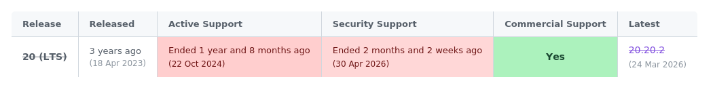
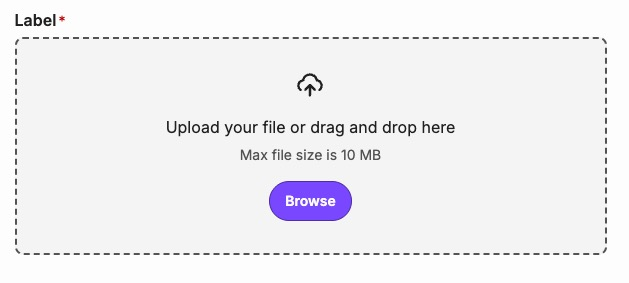

# 2026-07-08 Spirit Design System 💫 Essence (v5) Release Notes

Ahoy, we have great news for you today: the fifth major release of the Spirit Design System has just rolled out! It is called 💫 **Essence**, and it brings a composition-based rewrite of our form controls, a unified `ControlButton`-based close button across the system, and a visual refresh built on the new color-scheme and typography tokens.

Thanks to the color-scheme migration and the form fields refactor, **our CSS is about 11 % smaller**.

```txt
Difference (v5 vs v4):

-40,441 B raw total (~11.1% smaller)
-3,214 B gzip total (~8.1% smaller)
```

## General Changes

- 🟢 We have dropped support for Node.js v20 across every package — **Node.js v22 is now required**.



- 🧩 `Checkbox`, `Radio`, `Toggle`, `File`, and `FileUpload` are rewritten as composable components.
- 🔘 Every component-specific close button (`DrawerCloseButton`, `ModalCloseButton`, `TooltipCloseButton`, `ToastBar`'s button) is unified into a single `ControlButton`-based `CloseButton`.
- 🎨 `Button`, `Tag`, `Navigation`, `Pagination`, `Tabs`, `Breadcrumbs`, `Tooltip`, `Toast`, `Accordion`, `Avatar`, `Pill`, `Alert`, and `SegmentedControl` move onto the new typography and color-scheme tokens, and form fields gain `Fill`/`Outline` variants built on new `InputContainer`/`InputAddon` primitives.

- 🧱 `UNSTABLE_Header` is stabilized as `Header`, and also `UNSTABLE_File`/`UNSTABLE_FileUpload`. Legacy components have been removed.




- 🎰 `Item` now composes its content via slots.

🪄 Most of the breaking changes in the `web-react` and `web` packages are covered with codemods! To make the transition to this release even easier, run the automated scripts from `@alma-oss/spirit-codemods`.

📜 For all changes, please visit our [migration guides](https://github.com/alma-oss/spirit-design-system/tree/main/docs/migrations).

## News in Packages

&nbsp;

📦 **Web React _5.0.0 → 5.1.0_** `@alma-oss/spirit-web-react`

### Breaking Changes

- Composition rewrite of `Checkbox`, `Radio`, `Toggle`, `File`, and `FileUpload`; close buttons unified into `CloseButton`; `ControlButton` default size scale, colors, and Node.js v22 requirement.

📜 Please see the [migration guide](https://github.com/alma-oss/spirit-design-system/blob/main/docs/migrations/web-react/migration-v5.md) to upgrade smoothly, or check the [full changelog](https://github.com/alma-oss/spirit-design-system/compare/@alma-oss/spirit-web-react@4.9.0...@alma-oss/spirit-web-react@5.1.0) for the complete list of changes.

&nbsp;

📦 **Web _5.0.0 → 5.0.1_** `@alma-oss/spirit-web`

### Breaking Changes

- Same composition and `CloseButton`/`ControlButton` changes as `web-react`, plus the visual/typography realignment across components and the `header` → `navigation` / Filled → Fill token renames.

📜 Please see the [migration guide](https://github.com/alma-oss/spirit-design-system/blob/main/docs/migrations/web/migration-v5.md) to upgrade smoothly, or check the [full changelog](https://github.com/alma-oss/spirit-design-system/compare/@alma-oss/spirit-web@4.8.0...@alma-oss/spirit-web@5.0.1) for the complete list of changes.

&nbsp;

📦 **Design Tokens _5.0.0_** `@alma-oss/spirit-design-tokens`

### Breaking Changes

- Component tokens renamed from `header` to `navigation` #DS-2589, Form Field "Filled" tokens renamed to "Fill" #DS-2502, and Node.js v22 is now required #DS-2597.

📜 Please see the [migration guide](https://github.com/alma-oss/spirit-design-system/blob/main/docs/migrations/design-tokens/migration-v5.md) to upgrade smoothly, or check the [full changelog](https://github.com/alma-oss/spirit-design-system/compare/@alma-oss/spirit-design-tokens@4.2.2...@alma-oss/spirit-design-tokens@5.0.0) for the complete list of changes.

&nbsp;

📦 **Icons _4.0.0_** `@alma-oss/spirit-icons`

### Breaking Changes

- Node.js v22 is now required #DS-2597.

Here is the [full changelog](https://github.com/alma-oss/spirit-design-system/compare/@alma-oss/spirit-icons@3.0.8...@alma-oss/spirit-icons@4.0.0) of the Icons package.

&nbsp;

📦 **Codemods _3.0.0_** `@alma-oss/spirit-codemods`

### Breaking Changes

- Node.js v22 is now required #DS-2597.

### Features

- New codemods for the v5 migration: `ValidationText` icon prop, `File`/`FileUpload` stabilization, `Stack`/`StackItem` wrapping, `UNSTABLE_Header` → `Header` rename, and `Item` restructuring.

Here is the [full changelog](https://github.com/alma-oss/spirit-design-system/compare/@alma-oss/spirit-codemods@2.0.8...@alma-oss/spirit-codemods@3.0.0) of the Codemods package.

&nbsp;

📦 **Analytics _3.0.0_** `@alma-oss/spirit-analytics`

### Breaking Changes

- Node.js v22 is now required #DS-2597.

Here is the [full changelog](https://github.com/alma-oss/spirit-design-system/compare/@alma-oss/spirit-analytics@2.0.8...@alma-oss/spirit-analytics@3.0.0) of the Analytics package.

## What's Next 🔮

- We're carrying the composition and color-scheme work forward, rounding out remaining components on the new tokens and closing out any v5 follow-up fixes.
- We're finishing up `Combobox` for React — a multi-select, filterable picker for job positions, locations, and similar search-style filters.
- Our next major release, 🔥 **Flame**, is coming before Christmas! It will drop support for Node.js v22 in favor of v24, upgrade to React v19, and bring a bunch of additional smaller changes. 🚀

🎯 You can see more of our [quarterly targets outlook in Notion](https://www.notion.so/almacareer/Spirit-DS-team-Quarterly-Goals-878e92d5b74543039e513c0160fb9117).

## We'd Love to Hear Your Feedback

💬 If you need help or want to report a bug or wrong behavior, please reach out to us on our Slack channel: [#spirit-design-system-support_cs_en](https://slack.com/archives/C068XPSDWQN).

&nbsp;

🐙 Everything is available in our [repository on GitHub](https://github.com/alma-oss/spirit-design-system/).

&nbsp;

Thank you for staying with us! ❤️

---

**Fun Fact**

The next major version of the Spirit Design System will be called 🔥 **Flame**.
